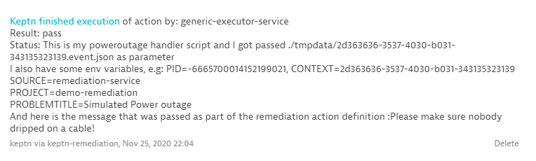

# Generic Executor Service for Keptn

This is a Sandbox Keptn Service that enables generic execution of bash files, Python3 and HTTP requests for individual Keptn Events 


[](https://travis-ci.org/keptn-sandbox/generic-executor-service)
[](https://goreportcard.com/report/github.com/keptn-sandbox/generic-executor-service)

This implements a generic-executor-service for Keptn.

## Compatibility Matrix

| Keptn Version    | [Generic Executor Service for Keptn](https://hub.docker.com/r/keptnsandbox/generic-executor-service/tags) |
|:----------------:|:----------------------------------------:|
|       0.6.1      | grabnerandi/generic-executor-service:latest |
|       0.7.x      | grabnerandi/generic-executor-service:0.2 |
|       0.7.3      | keptnsandbox/generic-executor-service:0.3 |
|       0.8.x      | keptnsandbox/generic-executor-service:0.8.0 |

## Installation

The *generic-executor-service* can be installed as a part of [Keptn's uniform](https://keptn.sh).

### Deploy in your Kubernetes cluster

To deploy the current version of the *generic-executor-service* in your Keptn Kubernetes cluster, apply the [`deploy/service.yaml`](deploy/service.yaml) file:

```console
kubectl apply -n keptn -f deploy/service.yaml
```

This should install the `generic-executor-service` together with a Keptn `distributor` into the `keptn` namespace, which you can verify using

```console
kubectl -n keptn get deployment generic-executor-service -o wide
kubectl -n keptn get pods -l run=generic-executor-service
```

### Up- or Downgrading

Adapt and use the following command in case you want to up- or downgrade your installed version (specified by the `$VERSION` placeholder):

```console
kubectl -n keptn set image deployment/generic-executor-service generic-executor-service=your-username/generic-executor-service:$VERSION --record
```

### Uninstall

To delete a deployed *generic-executor-service*, use the file `deploy/*.yaml` files from this repository and delete the Kubernetes resources:

```console
kubectl delete -f deploy/service.yaml
```

## Usage

The purpose of the *generic-executor-service" is to allow users to provide either .sh (shell scripts), .py (Python3) or .http (HTTP Request) files that will be executed when Keptn sends different events, e.g: you want to execute a specific script when a deployment-finished event is sent.
The *generic-executor-service* by default handles all Keptn events and then searches for either .sh or .http files in the stage & service specific Keptn Git repo in the subfolder *generic-executor*. If it doesnt find either all.events.* or event.* file it looks in the stage folder. If nothing is there it looks in the project repo (master branch). 

Here is a sample folder structure in my Git repo for a specific service and stage:
```
[STAGE]/MYSERVICE/generice-xecutor
-- all.events.sh              <-- executed for all events for this service
-- configuration.change.py    <-- executed for configuration.change
-- configuration.change.http  <-- executed for configuration.change

[STAGE]/generic-executor
-- all.events.py              <-- executed for all events for all services unless file exists on service level
-- configuration.change.sh    <-- executed for configuration.change for all services unless file exists on service level
-- configuration.change.http  <-- executed for configuration.change for all services unless file exists on service level

[MASTER]/generic-executor
-- all.events.http            <-- executed for all events unless file exists on stage service level
-- configuration.change.sh    <-- executed for configuration.change for all services unless file exists on stage or service level
-- configuration.change.py    <-- executed for configuration.change for all services unless file exists on stage or service level
```

The *generic-executor-service* will first execute those files with the specific Keptn event name, e.g: `configuration.change.sh` or `configuration.change.py`. After that it will execute those with the name `all.events.sh` and `all.events.http` if they exist in the repo. This gives you the ability to specify one set of action that should be executed for every Keptn event (exception here are the action.triggered events - see more information below!). 
Good news is that you can also specify these files on a stage or project level. If the *generic-executor-service* doesnt find a file on service level it looks at stage level and then on project. The first that is found will be executed!

Here is the list of all event prefixes that you can use for your script names:
```
-- configuration.change.*
-- deployment.finished.*
-- tests.finished.*
-- start.evaluation.*
-- evaluation.done.*
-- problem.open.*
-- action.triggered.ACTIONNAME*
```

This gives you full flexiblity to provide a bash, python or http script for each event or specify a bash and http script that should be executed for all events.

Adding files into this structure could also be done with the `keptn` cli e.g. through:

```console
keptn add-resource --project=[PROJECT] --stage=[STAGE] --service=[SERVICE] --resource=local-folder/all.events.sh --resourceUri=generic-executor/all.events.sh
keptn add-resource --project=[PROJECT] --all-stages --service=[SERVICE] --resource=local-folder/all.events.http --resourceUri=generic-executor/all.events.http
```

**ATTENTION:** As mentioned above `action.triggered.*` is treated specially. The *generic-executor-service* only executes the first matching script starting but not all that match, e.g: if it finds `action.triggered.actionname.sh` it WONT execute a script with the name `all.events.sh`. More information on this behavior can be found in the section on auto-remediation below!

Please have a look at the sample .http, .py and .sh files to see how the *generic-executor-service* is not only calling these scripts or making http calls. The service is also passing Keptn Event specific context data such as PROJECT, SERVICE, LABELS and also ENV-Variables of the *generic-executor-service* pod as variables that you can reference. This gives you a lot of flexibility when writing these scripts.

### Sample HTTP Webhook
Here a sample http script that shows you how to call an external webhook with this capability.
The *generic-executor-service* will replace the every field in the incoming Keptn Event with its full data path, e.g: ${proejct}, ${data.project} or ${data.label.label1}. Environment Variables that are available on the generic-executor-service itself can be accessed like ${env.env-variable}
```http
configuration.change.http:
POST https://webhook.site/YOURHOOKID
Accept: application/json
Cache-Control: no-cache
Content-Type: application/cloudevents+json

{
  "contenttype": "application/json",
  "deploymentstrategy": "blue_green_service",
  "project": "${data.project}",
  "service": "${data.service}",
  "stage": "${data.stage}",
  "mylabel" : "${data.label.gitcommit}",
  "mytoken" : "${env.testtoken}",
  "shkeptncontext": "${shkeptncontext}",
  "type": "${type}",
  "source": "${source}"
}
```

### Sample Bash Script
And here a sample bash script that the *generic-executor-service* is calling by setting all the Keptn incoming event fields as well as the generic-executor-service environment variables as environment variables for this script:
```bash
all.event.sh:
#!/bin/bash

# This is a script that will be executed by the Keptn Generic Executor Service for ANY event as the filename is called all.events.sh!
# It will be called with a couple of enviornment variables that are filled with Keptn Event Details, Env-Variables from the Service container as well as labels

echo "This is my all.events.sh script"
echo "Project = $DATA_PROJECT"
echo "Service = $DATA_SERVICE"
echo "Stage = $DATA_STAGE"
echo "Image = $DATA_CONFIGURATIONCHANGE_VALUES_IMAGE"
echo "DeploymentStrategy = $DATA_DEPLOYMENT_DEPLOYMENTSTRATEGY"
echo "TestToken = $ENV_TESTTOKEN"

# Here i could do whatever I want with these values, e.g: call an external tool :-)

```

### Sample Python Script

For Python please be aware the the *generic-executor-service* container comes with a Python3 runtime and also an installed `requests` module. Any other depending modules are not installed. If you need them either file an issue so we can include them in future builds or simply fork this repository and build your own customized version by installing any additional modules in the Dockerfile:

Here a sample python script that the *generic-executor-service* is calling by setting all the Keptn context, labels and container environment variables as environment variables for this script:
```python
action.triggered.myaction.py:
import os
import sys

# Lets get the first parameter which could potentially be a local file name
methodArg = ""
if len(sys.argv) > 1:
    methodArg = sys.argv[1]

print("This is my genericactionname handler script and I got passed " + methodArg + " as parameter")
print("I also have some env variables, e.g: PID=" + os.getenv('DATA_PROBLEM_PID', "") + ", SHKEPTNCONTEXT=" + os.getenv('SHKEPTNCONTEXT', ""))
print("SOURCE=" + os.getenv('SOURCE',""))
print("PROJECT=" + os.getenv('DATA_PROJECT',""))
print("PROBLEMTITLE=" + os.getenv('DATA_PROBLEM_PROBLEMTITLE',""))
print("And here is the message that was passed as part of the remediation action definition :" + os.getenv("DATA_ACTION_VALUE_MESSAGE", "NO MESSAGE"))

```

### Event file passed as parameter

You may have seen it in the python example. The *generic-exectutor-service* is also passing the full Keptn Event that triggered that execution as script argument. The first parameter is the reference to that filename. This gives you full access to the raw Keptn CloudEvent.

### Returning errors or follow up event

The *generic-executor-service* is analyzing the output of the script. In general it allows any type of output which will then be logged out to the console.
It also allows however for some special output allowing you to return an error message in case of an error or allowing you to send a Keptn event as a follow up to your script.

**1: Return error details**

The following is an output example that indicates that the script ran into an error and it gives a more clear error message:
```json
{
  "error" : "errormessage"
}
```

**2: Return Keptn Event**

Your scripts can also return a JSON object that will be used for the finished event in case your script handles a triggered event.
In that case - simply output the fields that will go into the task names list of properties.

To give you an example - if you handle the test.triggered event you can output the following to the console:

```json
{
  "start" : "2020-11-19T16:41:00Z",
  "end" : "2020-11-19T17:41:00Z"
}
```

Enjoy the fun!

## Usage for Remediation Actions

The *generic-executor-service* provides an easy way to define your own **Auto-Remediation Actions** that Keptn can trigger as a part of an Remediation Workflow.
In order for you to have your script executed for a particular remediation action simply give the script the following name: action.triggered.<ACTIONNAME>.xx.
Actionname references the name of the action in your remediation.yaml. So - the following remediation.yaml defines the action *poweroutageaction*:
```yaml
apiVersion: spec.keptn.sh/0.1.4
kind: Remediation
metadata:
  name: dynatrace-demo-remediation
spec:
  remediations:  
  - problemType: Simulated Power outage
    actionsOnOpen:
    - name: Handle Power Outage
      action: poweroutageaction
      description: In a power outage scenario we make sure nobody dripped on a cable
      value:
        Message: Please make sure nobody dripped on a cable!
```

To provide a script for that action you can upload the following filenames:
* action.triggered.poweroutageaction.py
* action.triggered.poweroutageaction.sh
* action.triggered.poweroutageaction.http

Besides the environment variables described above this script also gets env-variables passed with the prefix VALUE_ for each value in the values list. In the example above there is one *value* with the name *Message*. To access the value of this you can simply access the environment-variable *VALUE_MESSAGE*
For a full example check out the script *action.triggered.myaction.py* which you can find in the files subfolder!

### Return Result and Status
The *generic-executor-service* will send a `sh.keptn.event.action.finished` once the script finished execution. That event includes two fields telling Keptn more about the result (pass or fail) and status (optional more detailed description of the result) of that execution.

The *generic-executor-service* will set `result` to `pass` if the script executed with error code 0 or if an HTTP WebHook returned 2xx (200-299). If not - it will return `fail`

As for the `status` field: If the script writes to the console this output will be set in the `status` field allowing you to pass on any type of output back to Keptn and to other services that are listening to the `sh.keptn.event.action.finished` event, e.g.: The *dynatrace-service* will push this as a comment on the problem ticket that triggered the remediation workflow!
If you are executing an HTTP webhook the response body will be passed in the `status` field!
If no content is generated then the *generic-executor-service* simply defaults to either `succeeded` or `errored`!

Here is a sample action.finished event sent to Keptn:
```json
{
  "contenttype": "application/json",
  "data": {
    "action": {
      "result": "pass",
      "status": "This is my poweroutage handler script and I got passed ./tmpdata/2d363636-3537-4030-b031-343135323139.event.json as parameter\nI also have some env variables, e.g: PID=-6665700014152199021, CONTEXT=2d363636-3537-4030-b031-343135323139\nSOURCE=remediation-service\nPROJECT=demo-remediation\nPROBLEMTITLE=Simulated Power outage\nAnd here is the message that was passed as part of the remediation action definition :Please make sure nobody dripped on a cable!\n"
    },
    "labels": {
      "Problem URL": "https://abc1234.live.dynatrace.com/#problems/problemdetails;pid=-6665700014152199021_1606338043710V2",
      "poweroutageaction": "action.triggered.poweroutageaction.py"
    },
    "project": "demo-remediation",
    "service": "allproblems",
    "stage": "production"
  },
  "id": "6187a43a-7112-4cd8-a4d1-1dcc3b5d11c1",
  "source": "generic-executor-service",
  "specversion": "1.0",
  "time": "2020-11-25T21:04:01.832Z",
  "type": "sh.keptn.event.action.finished",
  "shkeptncontext": "2d363636-3537-4030-b031-343135323139"
}
```

And here a screenshot of the Dynatrace problem showing result and status as part of the comment:


All the best with using this for auto-remediation workflows!


## Development

Be my guest and help me extend this Generic Executor Service for Keptn with new capabilities. 

### Where to start

If you don't care about the details, your first entrypoint is [eventhandlers.go](eventhandlers.go). This is where it handles incoming Keptn events
 
To better understand Keptn CloudEvents, please look at the [Keptn Spec](https://github.com/keptn/spec).
 
If you want to get more insights, please look into [main.go](main.go), [deploy/service.yaml](deploy/service.yaml),
 consult the [Keptn docs](https://keptn.sh/docs/) as well as existing [Keptn Core](https://github.com/keptn/keptn) and
 [Keptn Contrib](https://github.com/keptn-contrib/) services.

### Build yourself

If you want to build this service yourself here is what you need to do

* Build the binary: `go build -ldflags '-linkmode=external' -v -o generic-executor-service`
* Run tests: `go test -race -v ./...`
* Build the docker image: `docker build . -t your-username/generic-executor-service:dev` (Note: Replace `your-username` with your DockerHub account/organization)
* Push the docker image to DockerHub: `docker push your-username/generic-executor-service:dev` (Note: Replace `your-username` with your DockerHub account/organization)
* Deploy the service using `kubectl`: `kubectl apply -f deploy/` (Note: Update the image reference in the service.yaml to point to your docker image on DockerHub)
* Undeploy the service using `kubectl`: `kubectl apply -f deploy/`
* Watch the deployment using `kubectl`: `kubectl -n keptn get deployment generic-executor-service -o wide`
* Get logs using `kubectl`: `kubectl -n keptn logs deployment/generic-executor-service -f`
* Watch the deployed pods using `kubectl`: `kubectl -n keptn get pods -l run=generic-executor-service`
* Deploy the service using [Skaffold](https://skaffold.dev/): `skaffold run --tail` (Note: please adapt the image name in [skaffold.yaml](skaffold.yaml))

### Testing Cloud Events

We have dummy cloud-events in the form of PostMan Requests in the [test-events/](test-events/) directory.

## License

Please find more information in the [LICENSE](LICENSE) file.
